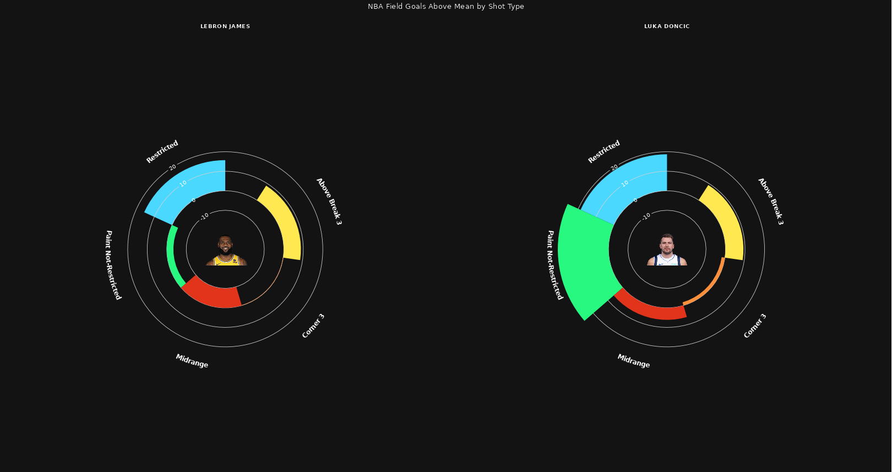

# NBA FGAM

The goal of [NBA FGAM](https://ymelamed.shinyapps.io/FGAM/) is to identify which players have been shooting well/poorly in each shot location relative to the rest of the league, taking their shot volume in to account. I use NBA API data from the hoopR package, calling season long shot location data from the function 'nba_leaguedashplayershotlocations().' I calculate the average FG% for each shot location, then multiply that by each player's number of attempted field goals (I also strip out each player's shots from the average). I then take this measure, which shows how many shots a player would make if he was shooting a league average % given his volume, and subtract it from how many shots the player has actually made, resulting in the "Field Goals Above the Mean" metric. I developed an R Shiny App with radar graphs that compare 2 players of choice and a sortable player leaderboard.

# Built with:

-   hoopR (NBA Stats API)
-   R Shiny

# Screenshot:

